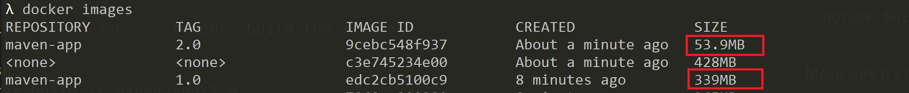

# Lightweight Java Docker image with a custom JRE

## Background

If you have tried to create a Docker container image for a Java application, you know it tends to be large because:

- Official Java base Docker images are relatively large. For example, the `openjdk:12-alpine` has **339MB**.
- There are many classes that might not be used by your application, but they are bundled anyway by the JRE. For example, application servers that run in headless mode still bundle graphical packages such as `javax.swing`. Therefore, to run a small program, we have to maintain a complete JRE, which is simply a waste of memory.

You can have a leightweight Java Docker image by:

- Leveraging [alpine](https://hub.docker.com/_/alpine) as the base image - a minimal Docker image based on Alpine Linux with a complete package index and only **5 MB** in size!
- Creating a custom JRE that contains only the platform modules that are required for the application using [jlink](https://docs.oracle.com/en/java/javase/11/tools/jlink.html) tool (available for Java 9 or later).

<!-- ## Modularization and jlink

Package visibility -->

## About the samples

This repo contains two identical projects, where one uses the default JRE (`maven-app-v1`) while the other leverages a custom JRE (`maven-app-v2`).

Both are simple Maven projects with the same `App.java` structure to log a 'Hello World!' message:

```java
package com.sample.app;

import org.slf4j.Logger;
import org.slf4j.LoggerFactory;

public class App {
    private static final Logger LOGGER = LoggerFactory.getLogger(App.class);
    
    public static void main(String[] args) {
        LOGGER.info("Hello World!");
    }
}
```

Both project only need these classes to run: `com.sample.app.App`, `String`, `org.slf4j.Logger` and `org.slf4j.LoggerFactory`. The difference between these projects are:

- The `maven-app-v1` is a default Maven project that uses the `openjdk:12-alpine` as the Docker base image.
- The `maven-app-v2` is a modularized Maven project that uses [jlink](https://docs.oracle.com/en/java/javase/11/tools/jlink.html) to create a custom JRE and uses `alpine:3.8` as the Docker base image.

The custom JRE is only possible by defining modules on a `module-info.java` file:

```java
module com.sample.jlink {
    requires org.slf4j;
    exports com.sample.app;
}
```

## Prerequisites

For just building and running containers:

- [Docker](https://docs.docker.com/install/) (Windows, Linux or Mac)

For development purposes:

- Java JDK 9 or later
- [Maven](https://maven.apache.org/install.html) 3.x or later

## Getting Started

### **Building and running the Maven App v1**

On the `maven-app-v1` folder, build the image:

```sh
docker build -t maven-app:1.0 .
```

Make sure it's running:

```sh
docker run maven-app:1.0
```

It's expected to see the following log: `[main] INFO com.sample.app.App - Hello World!`.

### **Building and running the Maven App v2**

On the `maven-app-v2` folder, build the image:

```sh
docker build -t maven-app:2.0 .
```

Make sure it's running:

```sh
docker run maven-app:2.0
```

It's expected to see the following log: `[main] INFO com.sample.app.App - Hello World!`.

## Comparing results

Now let's list and compare the image size for each application with the following command:

```sh
docker images
```

The result will be similar to this one:



The image size was reduced from **339MB** to **53.9MB**, representing **~84%** reduction in the image size. Really impressive!
## Notes

- The `maven-app-v2` sample uses `alpine:3.8` as the base image, while the `maven-app-v1` uses the `openjdk:12-alpine`. This is because the `openjdk:12-alpine` image already comes with the default JRE, while the `alpine:3.8` doesn't, so we add the custom JRE in the alpine image. 

