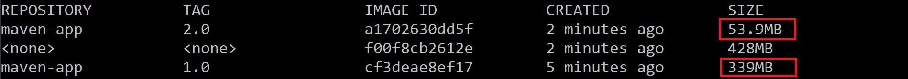

# Docker image size optimization for Java applications

## Background

If you have tried to create a Docker image for a Java application, you know it tends to be large because:

- Official Java base Docker images are relatively large. For example, the `openjdk:12-alpine` has **339MB**.
- There are many classes that might not be used by your application, but they are bundled anyway by the JRE (for example, application servers that run in headless mode still bundle graphical packages such as `javax.swing`). Even for a small application we have to maintain a complete JRE, which is simply a waste of memory.

In this repository we use the following approaches to have a smaller Docker image:

1. **Java modularity**. Java 9 introduced a new level of packages abstraction known as *modules*, making possible to eliminate unnecessary modules that are part of the JDK as they are (most of them) decoupled.
2. **Create a custom JRE using** [jlink](https://docs.oracle.com/en/java/javase/11/tools/jlink.html) and [jdeps](https://docs.oracle.com/javase/8/docs/technotes/tools/windows/jdeps.html). We want a JRE that contains only the platform modules that are required by the application.
3. **Multi-stage builds**. Creating a custom JRE allows us to leverage smaller final images like [alpine](https://hub.docker.com/_/alpine) - a minimal Docker image based on Alpine Linux with a complete package index and only **5 MB** in size!

## Prerequisites

For development purposes:

- Install Java JDK 9 or later
- Install [Maven](https://maven.apache.org/install.html) 3.x or later

For building and running containers:

- Install [Docker](https://docs.docker.com/install/)

## About the samples

This repository contains **Maven** and **Spring Boot** samples, structured in the following way:

| Folder      | Description |
|-------------|-------------|
| maven       | The `maven-app-v1` folder contains a Maven project using the default JRE, while the `maven-app-v2` is similar but using a custom JRE.|
| spring-boot | The `spring-boot-default` folder contains a Spring Boot project using the default JRE, while the `spring-boot-custom` is similar but using a custom JRE.|

## Comparing results

You can build all Docker images for Maven and Spring Boot applications to compare image sizes.

### **Maven**

Follow the instructions described [here](./docs/maven-results.md) to compare results of `maven-app-v1` and `maven-app-v2` projects.

The image size was reduced from **339MB** to **53.9MB**, representing **~84.1%** reduction in the image size.

### **Spring Boot**

Follow the instructions described [here](./docs/spring-boot-results.md) to compare results of `spring-boot-default` and `spring-boot-custom` projects.

The image size was reduced from **358MB** to **113MB**, representing **~68.4%** reduction in the image size.

