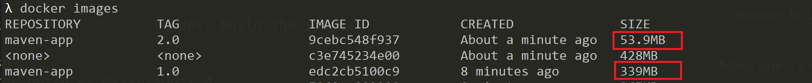

# Comparing results (Maven)

The `maven` folder contains two identical projects, where one uses the default JRE (`maven-app-v1`) while the other leverages a custom JRE (`maven-app-v2`).

Both are simple Maven projects with the same `App.java` structure to log a 'Hello World!' message:

```java
package com.sample.app;

import org.slf4j.Logger;
import org.slf4j.LoggerFactory;

public class App {
    private static final Logger LOGGER = LoggerFactory.getLogger(App.class);
    
    public static void main(String[] args) {
        LOGGER.info("Hello World!");
    }
}
```

The difference between these projects are:

- The `maven-app-v1` is a **default** Maven project that uses the `openjdk:12-alpine` as the Docker base image.
- The `maven-app-v2` is a **modularized** Maven project that uses [jlink](https://docs.oracle.com/en/java/javase/11/tools/jlink.html) to create a custom JRE and uses `alpine:3.8` as the Docker base image.

## Getting Started

### **Building and running the default project**

On the `maven-app-v1` folder, build the image:

```sh
docker build -t maven-app:1.0 .
```

Make sure it's running:

```sh
docker run maven-app:1.0
```

It's expected to see the following log: `[main] INFO com.sample.app.App - Hello World!`.

### **Building and running the project with custom JRE**

On the `maven-app-v2` folder, build the image:

```sh
docker build -t maven-app:2.0 .
```

Make sure it's running:

```sh
docker run maven-app:2.0
```

It's expected to see the following log: `[main] INFO com.sample.app.App - Hello World!`.

## Results

Now let's list and compare the image size for each application with the following command:

```sh
docker images
```

The result will be similar to this one:



The image size was reduced from **339MB** to **53.9MB**, representing **~84%** reduction in the image size.

> **Note:** The `maven-app-v2` sample uses `alpine:3.8` as the base image, while the `maven-app-v1` uses the `openjdk:12-alpine`. This is because the `openjdk:12-alpine` image already comes with the default JRE, while the `alpine:3.8` doesn't, so we add the custom JRE in the alpine image. 
